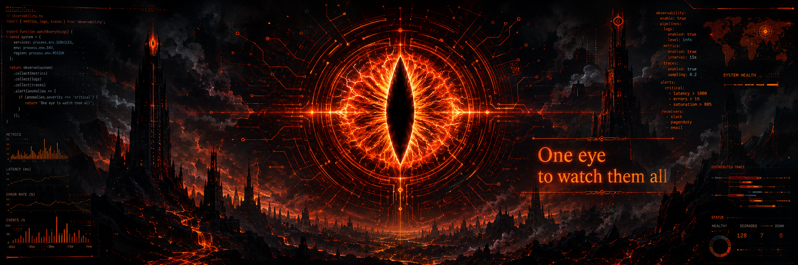

<p align="center">
  
</p>

<h1 align="center">Eric Rodriguez</h1>

<p align="center">
  <strong>Head Fullstack Developer from Argentina 🇦🇷</strong>
</p>

<p align="center">
  I build systems, lead teams, and occasionally investigate bugs that were
  <em>"definitely not touched."</em>
  <br />
  Keeping one eye on production at all times. 👁️
</p>

<p align="center">
  <a href="https://eric-erodriguez-port.vercel.app/">
    
  </a>
  <a href="https://www.linkedin.com/in/eric-e-dev/">
    
  </a>
  <a href="https://www.kolektor.com.ar/">
    
  </a>
</p>

---

```js
const eric = {
  role: "Head Fullstack Developer",
  experience: "6+ years",
  location: "Argentina",

  currentMode: "building, reviewing, shipping",

  architecture: "fewer future regrets",
  aiAgents: "under supervision",
  openSource: "shipping VS Code extensions",

  eyeOfSauron: true,
  productionStatus: "under surveillance",

  bugsFixed: "a lot",
  bugsCreated: "also a lot",

  caffeineLevel: "structurally important",
};
```

## 👁️ What I Actually Do

- Design architecture that can survive real traffic, changing requirements, and well-intentioned shortcuts.
- Work across backend, frontend, and delivery without treating those as separate planets.
- Lead teams, review code, unblock people, and keep projects moving without turning everything into meetings.
- Translate messy business ideas into maintainable systems that other developers won't hate in six months.

---

## 🔥 Stack Under Surveillance

### Frontend

<p>
  
  
  
  
  
  
</p>


### Backend

<p>
  
  
  
  
  
  
  
</p>

### Infra & Delivery

<p>
  
  
  
  
</p>

### Tools & Data

<p>
  
  
  
  
  
  
</p>

---

## 🤖 AI Under Supervision

I build with AI as an engineering tool — not as a replacement for engineering.

- Designing and orchestrating multi-agent workflows.
- Building developer tooling around Claude Code, Codex, and GitHub Copilot.
- Working with AI agents, tools, skills, MCP servers, and human-in-the-loop handoffs.
- Exploring how AI can improve development workflows without turning the codebase into an archaeological site.
- Treating AI-generated code the same way I treat human-generated code: review it, test it, and don't blindly trust it.

<p>
  
  
  
  
  
  
</p>

> AI gets a seat at the table. Production still requires adult supervision.


---

## 🧩 Open Source & VS Code

Sometimes the tool I want doesn't exist.

So I build it.

### 🤖 Agent Studio

<a href="https://marketplace.visualstudio.com/items?itemName=AgentstudioIA.agent-studio-ia">
  
</a>

A visual control plane for building, managing, and orchestrating AI agents directly inside VS Code.

Multi-agent workflows, Claude & Codex execution, tools, skills, MCP servers, human handoffs, workflow visualization, and parallel agent execution.

---

### ✨ Claude Commit Message

<a href="https://marketplace.visualstudio.com/items?itemName=AgentstudioIA.claude-commit-message">
  
</a>

Generate meaningful Git commit messages from staged changes using Claude Code — directly from the VS Code Source Control panel.

Because writing:

`fix stuff`

was never a sustainable commit strategy.

---

### ⚡ Copilot Statusbar Toggle

<a href="https://marketplace.visualstudio.com/items?itemName=synyster.copilot-statusbar">
  
</a>

A lightweight status bar control for enabling or disabling GitHub Copilot autocomplete without digging through settings.

Because sometimes you want Copilot.

And sometimes Copilot needs to sit quietly for a minute.

---

## 🔎 What The Eye Usually Sees

- Debugging in production with just enough context to be dangerous.
- Fixing the feature that was "working yesterday."
- Reading logs like a detective with trust issues.
- Fighting CORS, time zones, cache layers, and the occasional creative requirement.
- Deploying on Friday once in a while, then remembering why that was a bad idea.
- Refactoring code that started as a quick fix and somehow became infrastructure.

---

## 🎯 Current Focus

- Architecture with fewer future regrets.
- Scalable systems and cleaner boundaries between frontend, backend, and business logic.
- AI-assisted engineering and multi-agent development workflows.
- Developer tooling and open-source VS Code extensions.
- Leadership, mentoring, and code reviews that improve the team, not just the branch.

---

<details>
  <summary><strong>⚠️ Things about me you might regret knowing</strong></summary>

<br />

- I trust logs more than optimistic estimates.
- If I say "it should work," that is not a guarantee.
- I talk to my code. The code usually responds with edge cases.
- I keep one eye on production. Production knows.
- "Quick fix" is one of the most dangerous phrases in software engineering.

</details>

---

## 👁️ The Eye Never Sleeps

<p align="center">
  
</p>

---

## 📊 GitHub Signals

<p align="center">
  
</p>

<p align="center">
  
  
</p>

### 🔥 Contribution Streak

<p align="center">
  
</p>

---

<p align="center">
  <strong>One eye to watch them all. 👁️</strong>
</p>

<p align="center">
  Building systems • Reviewing code • Watching production • Questioning requirements
</p>

<p align="center">
  <sub>
    Feel free to inspect the repositories.<br />
    The Eye already is.
  </sub>
</p>